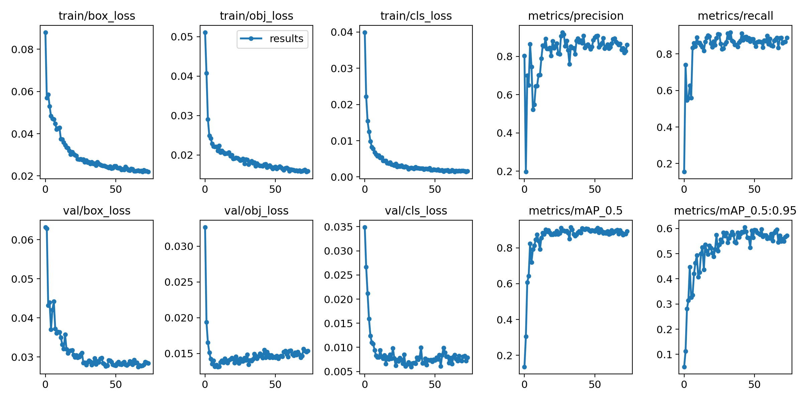
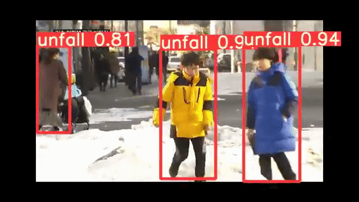

# ObsCare_Detection
## 소개
##### CCTV 실시간 영상처리에 활용될 영상처리모델 클래스입니다.
##### yolov5 및 deepSORT를 활용하여 웹캠을 소스로 받아와 식별 클래스에 바운딩 박스를 생성하고
##### 낙상, 보행보조사물이 감지될 경우 로그가 출력될 수 있도록 처리했습니다.
## 주요기능
### 1.  Model 클래스 
> ##### 학습된 모델이 웹캠의 영상을 읽어와 추론하고 , 추론된 결과에 따라 바운딩 박스를 생성합니다.
- 객체 생성시 학습된 인공지능 모델을 웹캠과 매칭시킵니다. 
- 매칭시킨 웹캠의 이미지를 인공지능모델의 추론 이미지사이즈에 맞게 변형시킵니다.
- 또한 본 모델은 FP16을 사용해 모델의 연산처리량을 향상시켰습니다.
- 누워있는사람이 감지되었을 때 5초간의 유예기간을 갖고 5초이상 누워있다면 메세지를 발생시킵니다.
- 휠체어,시각안내견,목발이 감지되었을 떄 즉시 메세지를 발생시킵니다.
### 2. YOLOv5 Model
> ##### 인공지능모델은 yolov5의 [yolov5x.pt](http://yolov5x.pt)를 전이학습 시킨 커스텀 모델입니다.
- 약 4500개의 이미지를 바탕으로 학습 시켰습니다.
- 총 구분 클래스는 다음과 같습니다.
    - 서있는 사람
    - 누워있는 사람
    - 휠체어
    - 시각안내견
    - 목발
### 3. DeepSort
> ##### 본 모델의 식별에 있어 각 바운딩 박스별 고유의 ID를 부여하기 위해 DeepSort를 적용했습니다.
- DeepSort를 통해 Object Tracking 및 박스별 ID를 통해 동시다발적 상황처리를 유연하게 처리할 수 있도록 했습니다.
https://drive.google.com/file/d/1ENyNxEmXgTz7lfkFEzeZqNvu-jW-5jAt/view?usp=sharing
## Requirement
```python
# base ----------------------------------------
Python==3.8.10
matplotlib>=3.2.2
numpy>=1.18.5
opencv-python>=4.1.0.34
Pillow
PyYAML>=5.3.1
scipy>=1.4.1
torch>=1.7.0
torchvision>=0.8.1
tqdm>=4.41.0
# plotting ------------------------------------
seaborn>=0.11.0
pandas
# deep_sort -----------------------------------
easydict
```
## 학습결과
- 모델 제작시 총 1500 장의 이미지를 사용했으며 mAP_0.5는 0.8이상입니다.

    (클래스 인스턴스의 총합 : 약 3500)
- 본 모델은 COCO dataset을 바탕으로 pre-train된 모델을 전이학습시켰습니다.



- 최종 모델은 YOLOv5m.pt모델을 전이 학습시켜 약 300의 epoch을 진행시켰으나, 80에서 Early stop되었습니다. 
-총 4개의 웹캠을 동시에 처리하기 위해 리소스 사용량을 줄인 모델을 사용했습니다.

MODEL DOWNLOAD : https://drive.google.com/file/d/1ENyNxEmXgTz7lfkFEzeZqNvu-jW-5jAt/view?usp=sharing

## 예시



- 본 프로그램은 모델을 활용한 ObsCare의 모습입니다.

## Link : [ObsCare](https://github.com/SSU-DC-DCWZ/ObsCare_Main)

## 기여자
**강병휘(essentialhrdy) : 모델 학습 및 Object Detection 처리**  

**이찬서(Lfollow-CS) : DB,Stream 관리 및 개별 프로젝트 통합**  
## BASE
**YOLOv5**  
[GitHub - ultralytics/yolov5: YOLOv5 🚀 in PyTorch > ONNX > CoreML > TFLite](https://github.com/ultralytics/yolov5)  

**Yolov5_DeepSort_Pytorch**  
[GitHub - mikel-brostrom/Yolov5_DeepSort_Pytorch: Real-time multi-object tracker using YOLO v5 and deep sort](https://github.com/mikel-brostrom/Yolov5_DeepSort_Pytorch)  
## 라이선스
#### 이 프로젝트는 [GNU General Public License v3.0](https://github.com/SSU-DC-DCWZ/ObsCare_Detection/blob/main/LICENSE)을 사용합니다.
